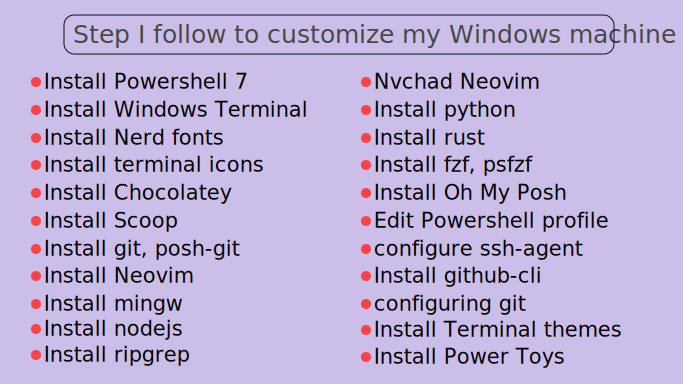
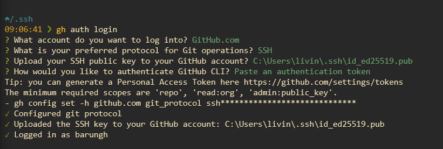

# 🔥 Configure Windows for Web Development   



***


https://user-images.githubusercontent.com/12285528/156337170-754f472c-b2f7-4ea8-b9be-58acd7b40a8b.mp4

***

### Install powershell 7
[Download from official realease page](https://github.com/PowerShell/PowerShell/releases/download/v7.2.1/PowerShell-7.2.1-win-x64.msi)  

### Install Windows Terminal  
[From Microsoft App Store](https://www.microsoft.com/en-us/p/windows-terminal/9n0dx20hk701#activetab=pivot:overviewtab)  

### Install Nerd Fonts  
[Nerd Fonts](https://github.com/ryanoasis/nerd-fonts/releases/tag/v2.1.0)  
[**My Consolas NF**](https://github.com/barungh/my-nerd-fonts)  

### Install Terminal icons  
[Powershell Terminal Icons](https://github.com/devblackops/Terminal-Icons)
```ps 
Install-Module -Name Terminal-Icons -Repository PSGallery
Import-Module -Name Terminal-Icons
```
### Install [chocolatey](https://chocolatey.org/install)  
> chocolatey is a package manager for windows  
```ps 
Set-ExecutionPolicy Bypass -Scope Process -Force; [System.Net.ServicePointManager]::SecurityProtocol = [System.Net.ServicePointManager]::SecurityProtocol -bor 3072; iex ((New-Object System.Net.WebClient).DownloadString('https://community.chocolatey.org/install.ps1'))
```
### Install [scoop](https://scoop.sh/)
```ps
Set-ExecutionPolicy RemoteSigned -scope CurrentUser
iwr -useb get.scoop.sh | iex
```
### Install Busybox
```ps 
scoop install busybox
```

### Install git 
```ps 
choco install git
```

### Instal Neovim and dependencies

```ps 
choco install neovim
choco install mingw
choco install nodejs
choco install ripgrep
```

### Install [NvChad](https://github.com/NvChad/NvChad) Neovim  
> ***Head to installation page***  
> [Windows Installation](https://nvchad.github.io/getting-started/setup#windows)  

**Install [Packer](https://github.com/wbthomason/packer.nvim) first**   
```ps
git clone https://github.com/wbthomason/packer.nvim "$env:LOCALAPPDATA\nvim-data\site\pack\packer\start\packer.nvim"

```
### My Neovim Configuration
```ps 
git clone https://github.com/barungh/nvim "$env:LOCALAPPDATA\nvim"
```

### Run Neovim for the first time
```ps 
nvim +'hi NormalFloat guibg=#1e222a' +PackerSync
```

### Install Python  
```ps 
python
```
> *Executing python command in Powershell will redirect to Microsoft App store Python download page if it is already not installed*  

### Install rust
[Rust download page](https://www.rust-lang.org/tools/install)


### Fzf and psfzf
```ps
choco install fzf

Install-Module -Name PSFzf -RequiredVersion 2.4.0
```

## Oh-My-Posh
Oh My Posh [installation instruction](https://ohmyposh.dev/docs/windows)
```ps 

choco install oh-my-posh

Invoke-Expression (oh-my-posh --init --shell pwsh --config "$env:LOCALAPPDATA/Programs/oh-my-posh/themes/themename.omp.json")

oh-my-posh --init --shell pwsh --config $env:LOCALAPPDATA\Programs\oh-my-posh\themes/di4am0nd.omp.json | Invoke-Expression


Get-PoshThemes # list all available themes

```  

https://user-images.githubusercontent.com/12285528/156334235-9b89021b-3219-41fe-8049-06d943c5e703.mp4


### Install Posh-git  
*Executing this command will install posh-git for current user porfile*  
```ps 
PowerShellGet\Install-Module posh-git -Scope CurrentUser -Force
```

### Configure powershell profile  
[Powershell Profile](https://devblogs.microsoft.com/scripting/understanding-the-six-powershell-profiles/)  

```ps 
nvim $PROFILE
```

### My powershell profile  
```ps 
Invoke-Expression (oh-my-posh --init --shell pwsh --config "$env:LOCALAPPDATA/Programs/oh-my-posh/themes/themename.omp.json")

oh-my-posh --init --shell pwsh --config $env:LOCALAPPDATA\Programs\oh-my-posh\themes/di4am0nd.omp.json | Invoke-Expression

Import-Module -Name Terminal-Icons 
Import-Module posh-git 
Import-Module PSFzf 

Set-PsFzfOption -PSReadlineChordProvider 'Ctrl+t' -PSReadlineChordReverseHistory 'Ctrl+r'

Set-Alias ls Get-ChildItem | Format-Table
Set-Alias ll Get-ChildItemColor | Format-Table


Start-Service ssh-agent

```

#### ssh-agent 
***ssh-agent by default is set to start automatically which can cause issue***  
so to change it, execute  
```ps
# to check start up type of ssh-agent
Get-Service ssh-agent | Select StartType  

# to set it to start manually
Get-Service -Name ssh-agent | Set-Service -StartupType Manual  
```

### Github cli
[Microsoft's Github CLI](https://docs.github.com/en/get-started/using-github/github-cli)
```ps 
choco install gh
```
### Create Github account (if you don't have it yet 😑)
[Github](https://github.com/)
```ps 
gh auth login
```



### configure git 
> create a project 
```ps 
git init # git command
git add . # git command
gh repo create # github cli command
git commit -m "My first commit ☺"

# at this stage you will get error 
# (if your git is not configured yet)
# so follow the instruction for
# minimal configuration
# then git commit again

git commit -m "My first commit ☺"
git push -u origin master
gh browse # github cli command

# git commands start with 'git' 
# whereas github cli commands start with 'gh'
```


### Windows Terminal Themes 
[Find terminal themes scheme here](https://windowsterminalthemes.dev/) and copy the scheme you want

> then head to  
```ps
cd $env:LOCALAPPDATA\Packages\Microsoft.WindowsTerminal_8wekyb3d8bbwe\LocalState
```
> and find setting.json file  
open it using nvim  
`nvim settings.json`  
copy your scheme on proper place  

### Power Toys
[Micorosoft PowerToys Official Page](https://docs.microsoft.com/en-us/windows/powertoys/)  
[Github Realese page](https://github.com/microsoft/PowerToys/releases/tag/v0.55.2)
> Install power toys and configure it  
test launcher
test color picker


### Watch it on Youtube 😎  
[](http://www.youtube.com/watch?v=JF9q6_c-_Ww)

